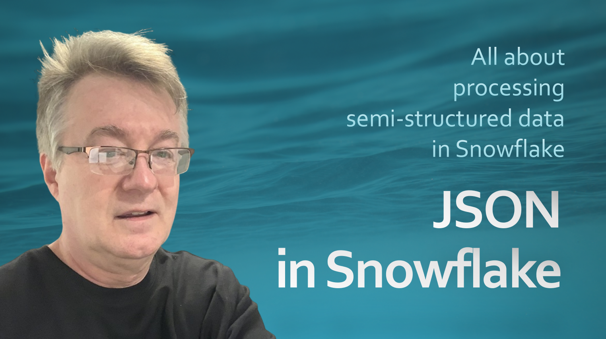

# JSON in Snowflake

All source code for my new **JSON in Snowflake Masterclass Hands-On** Udemy course.

## Current Project Setup

(1) Create a [**free Snowflake trial account**](https://signul.snowflake.com/), as described in the course lecture.  

(2) Install and configure [**Visual Studio Code (VSCode)**](https://code.visualstudio.com/).  

(3) From the *Extensions* tab, install the [**Snowflake Extension**](https://docs.snowflake.com/en/user-guide/vscode-ext). Connect to Snowflake with your account name, user name and password. For the account name, find the LOCATOR value from the *Admin > Account* tab, from the Snowflake web UI. 

(4) Install [**SnowSQL**](https://docs.snowflake.com/en/user-guide/snowsql-install-config). Then add in its [**config file**](https://docs.snowflake.com/en/user-guide/snowsql-config#about-the-snowsql-config-file) a section with your Snowflake connection parameters, as it follows:  

**`[test_conn]`**  
**`accountname = ...`**  
**`username = ...`**  
**`password = ...`**  

(5) Save also your Snowflake account password in a [**SNOWSQL_PWD**](https://docs.snowflake.com/en/user-guide/snowsql-start#specifying-passwords-when-connecting) environment variable.  

(6) From a command line, clone the [**GitHub repository for this course**](https://github.com/cristiscu/json-in-snowflake), using the command:  

**`git clone https://github.com/cristiscu/json-in-snowflake.git`**  

Then open the newly created *json-in-snowflake* folder from VSCode.

(7) Install [**Python**](https://www.python.org/downloads/).  

(8) From a VSCode *Terminal* window, create a **virtual environment for Python**:  

**`python.exe -m venv venv`**  

Activate the new environment (and make sure you always reactivate it whenever you run applications from the command line):  

**`venv/scripts/activate`**  

(9) In this environment, install all **Python dependencies** for our project with:  

**`pip install -r requirements.txt`**  

(10) For each individual lecture, switch to the related **sections/** subfolder from this project.  
